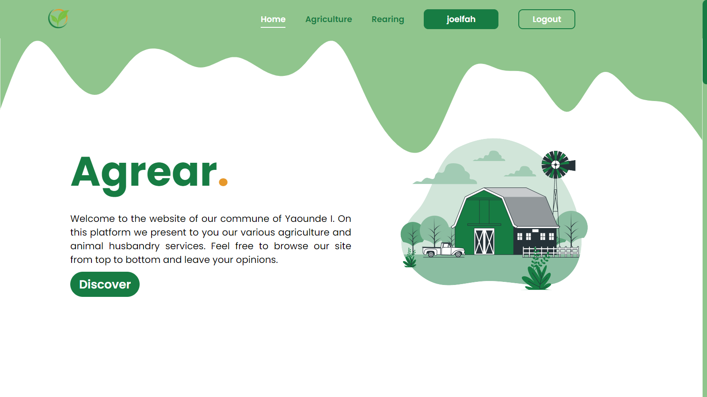

# <b>Agrear</b>
This is a web programming exercise for the course CSC 2064. In this exercise we were to build up a website for a council (town hall) which will present its agricultural and rearing activities. It should mainly consisit of pages containing these information and should also be able to manage authentication (login & registration) of users.

## <b>Installation & Launching</b>
It is very easy to lauch this website. You need to have the following installed in your computer.

<b>Requirement</b>
- Apache server, PHP and MySQL database installed through XAMPP.

### <b>Limitations</b>
The main limitation of this website is that it is ot responsive. It only displays well on laptops (1024 x 708 and higher)